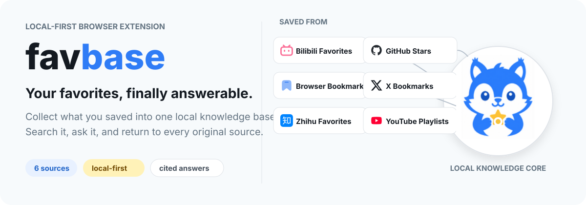
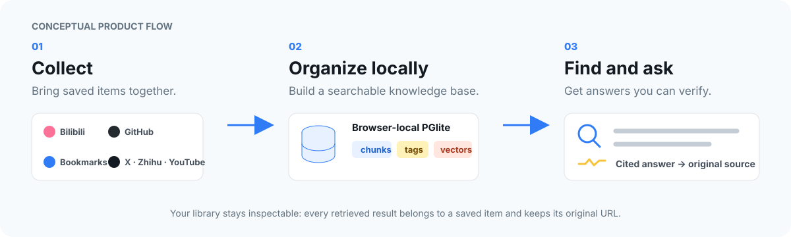

<p align="right">
  <strong>English</strong> · <a href="./README_zh_CN.md">简体中文</a>
</p>



favbase is a local-first Chromium browser extension that consolidates saved content from multiple sources into a browser-local knowledge base. It provides unified collection management, keyword and semantic search, AI-assisted organization, and question answering with references to the original content.

> [!NOTE]
> favbase has been released and remains under active development. Download the latest Chromium build from [GitHub Releases](https://github.com/InvisibleQAQ/favbase/releases/latest). Support for additional content sources will be introduced over time.

## Core capabilities

- **Unified source management.** Browse favorites, stars, bookmarks, and playlists from supported sources in one interface.
- **Local knowledge processing.** Extract text, divide it into searchable chunks, create tags, and generate embeddings in a local PGlite database.
- **Hybrid retrieval.** Combine keyword and semantic search across the collected library.
- **Source-grounded answers.** Ask questions about collected content and open the original item referenced by each answer.
- **Video text extraction.** Use official Bilibili subtitles when available, with configurable ASR as a fallback.
- **Portable data exports.** Create JSON or CSV backups, or generate an Obsidian-compatible ZIP archive.

## How it works



The diagram is a product-flow explanation, not a screenshot. A collected favorite becomes a **Collection Item** with its source URL and metadata. When content is available, favbase can chunk, tag, and embed it for retrieval. Search and Chat keep results tied to the original item so you can verify the context yourself.

## Supported sources

favbase currently integrates with the sources listed below. This list reflects the current release and will expand as additional integrations become available.

| Source | What favbase collects | Connection |
| --- | --- | --- |
| Bilibili | Favorite folders, videos, and available subtitle text | Your existing Bilibili browser session |
| GitHub | Starred repositories and repository details | A GitHub personal access token |
| Browser Bookmarks | Bookmark folders, links, and extractable page text | Local browser bookmark access |
| X | Bookmarks and post metadata | Your existing X browser session |
| Zhihu | Favorite collections, answers, and articles | Your existing Zhihu browser session |
| YouTube | Playlists, videos, and available metadata | A YouTube Data API key |

GitHub and YouTube must be configured under **Settings → Connections** before their first sync. Bilibili, X, and Zhihu reuse the login already present in the browser; favbase does not ask you to paste those account passwords.

## Privacy boundaries

“Local-first” describes where the knowledge database lives by default: favbase stores it in browser-local PGlite backed by IndexedDB. It does **not** mean every operation is offline or remains on-device.

- Collecting from a platform sends requests to that platform using the connection described above.
- LLM, embedding, ASR, and compatible AI features send the relevant query, text, or media to the provider you configure.
- Experimental WebDAV support currently synchronizes the whole app configuration and locale, **not the knowledge-base database**. That configuration can include API keys or tokens, so only use a WebDAV endpoint you trust.
- Export files contain your library data. Store and share them accordingly.

You can import and browse collected items without configuring every AI service. Semantic retrieval, AI tagging, Chat, and transcription fallbacks require their corresponding provider settings.

## Installation

### Install a release build

1. Open the [latest GitHub Release](https://github.com/InvisibleQAQ/favbase/releases/latest).
2. Download the Chromium build provided under **Assets**.
3. Extract the downloaded archive.
4. Open the browser's extensions page, such as `chrome://extensions`.
5. Enable **Developer mode**.
6. Choose **Load unpacked**.
7. Select the extracted extension directory that contains `manifest.json`.

After installation, open favbase, select a source, and run its first sync. Configure GitHub or YouTube credentials before using either source. Semantic retrieval requires an embedding provider; Chat and AI-generated tags require an LLM provider.

### Build from source

#### Requirements

- A Chromium-based browser
- [Git](https://git-scm.com/)
- [Node.js](https://nodejs.org/) and [pnpm](https://pnpm.io/)

#### Build and load

```bash
git clone https://github.com/InvisibleQAQ/favbase.git
cd favbase
pnpm install
pnpm build
```

1. Open your browser's extensions page, such as `chrome://extensions`.
2. Enable **Developer mode**.
3. Choose **Load unpacked**.
4. Select the generated `.output/chrome-mv3` directory.

## Development

favbase is built with WXT, React, TypeScript, PGlite/pgvector, and Vitest.

| Command | Purpose |
| --- | --- |
| `pnpm dev` | Start the extension development build |
| `pnpm build` | Create a production Chromium build |
| `pnpm compile` | Run TypeScript checks without emitting files |
| `pnpm test` | Run the test suite |

Architecture notes and implementation specifications live in [`docs/`](./docs/). Some documents record historical decisions; current source and tests remain authoritative when an older plan disagrees with the implementation.

## Project status and license

favbase has been released and remains under active development. Additional source integrations and workflow improvements are planned. Keep current backups of important library data while the storage model continues to evolve. Issues and focused pull requests are welcome.

Licensed under the [GNU General Public License v3.0](./LICENSE).
